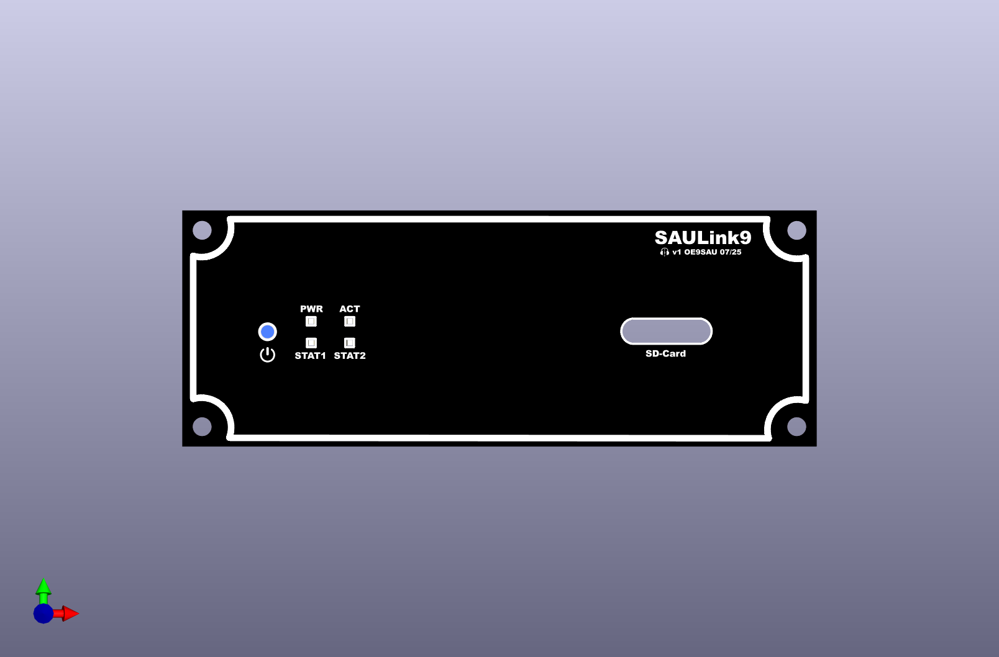
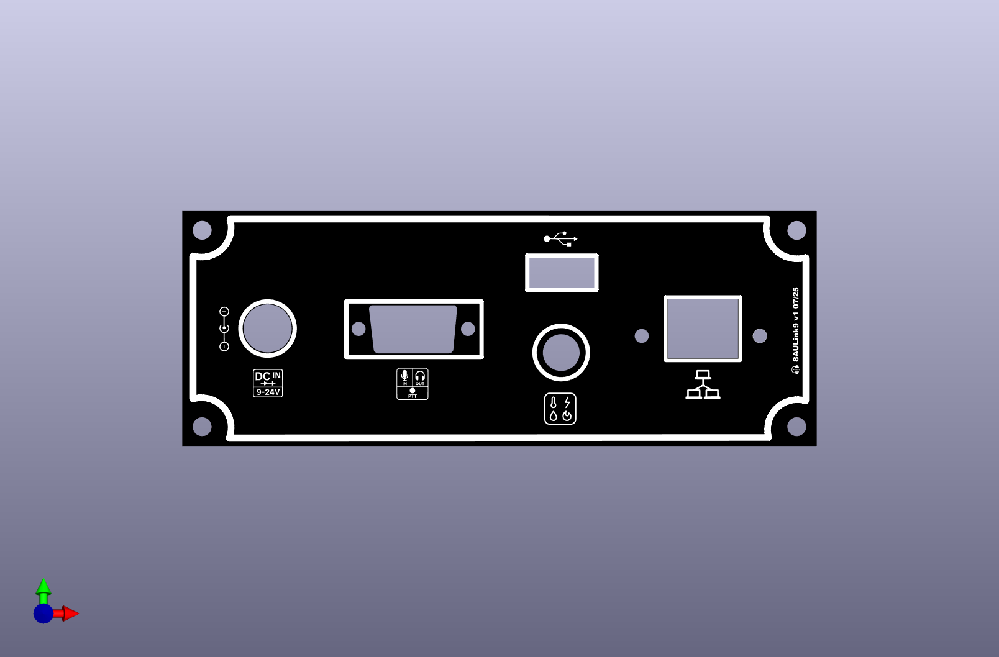

# SAULink9 Node Case
Front and back cover for a alu case from Amazon, fit all part´s you need to build up a SVXLink Repeater Node.

https://www.amazon.de/dp/B08DG2X7K5?ref=ppx_yo2ov_dt_b_fed_asin_title

